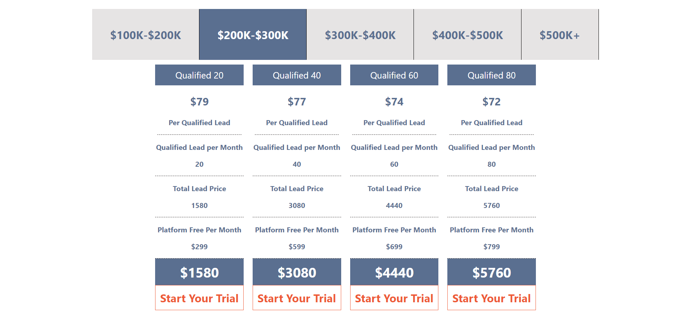
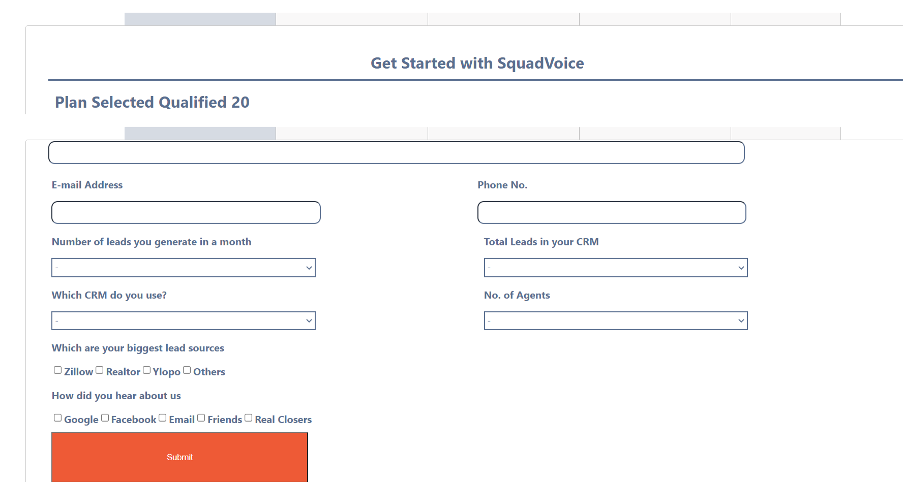

# Take Home Activity
## Technologies Used
> 1. React JS
>> - react-modal
>> - react-detect-offline

## How to run

First of all we need to install all the dependencies

    
    npm install

Then start using

    
    npm start

## Working

The application has components and have stored the data given in the tabular format into a json file

<b>PriceRangeHeader</b> component will be storing all the data given in tabs above, when onClick will chnage the data in the display of <b>PlanCard</b> component

Website will also store data in the browerstorage so that on next load it can be easily updated. If not the middle tab will be selected by default

# ScreenShots

